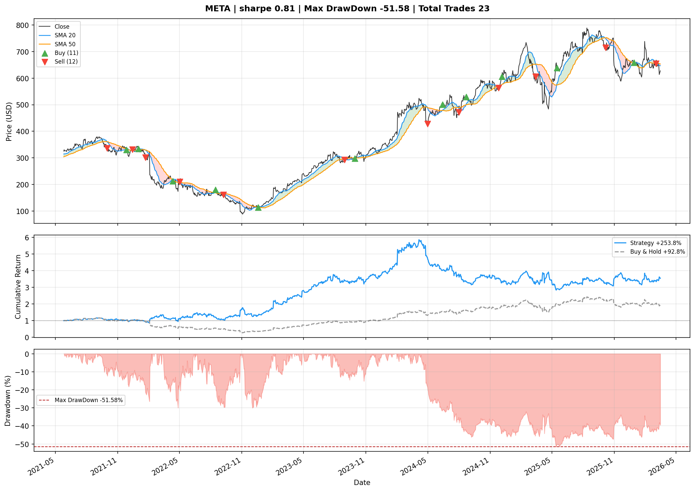
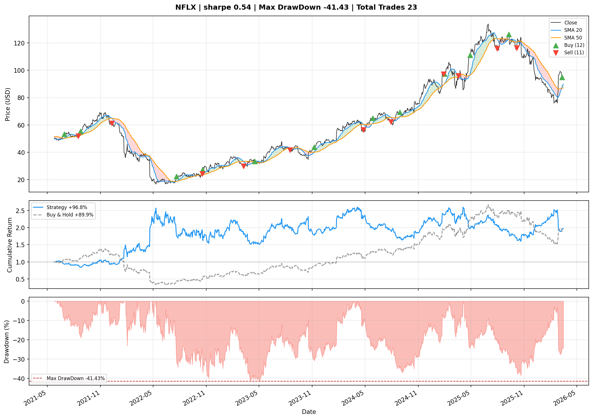

# Algorithmic Trading Backtesting Engine

Backtesting framework for SMA crossover strategies across S&P500 stocks.
Built with Python, Pandas, Matplotlib, and yfinance.

## Results — SMA 20/50 | 5 Years | 10bps transaction cost

| Ticker | Sharpe | Max Drawdown | Strategy Return | Market Return |
|--------|--------|--------------|-----------------|---------------|
| META   |  0.81  |   -51.58%    |    +253.8%      |    +92.8%     |
| NFLX   |  0.54  |   -41.43%    |     +96.8%      |    +89.9%     |
| NVDA   |  0.28  |   -80.25%    |      +6.4%      |  +1073.3%     |
| GOOGL  |  0.22  |   -57.57%    |     +10.8%      |   +160.8%     |
| TSLA   |  0.12  |   -78.28%    |     -39.3%      |    +96.7%     |
| JPM    |  0.02  |   -45.92%    |     -11.4%      |    +99.5%     |
| AAPL   | -0.18  |   -55.16%    |     -34.7%      |   +103.9%     |
| AMD    | -0.26  |   -87.56%    |     -74.6%      |   +152.5%     |
| MSFT   | -0.42  |   -64.44%    |     -50.0%      |    +64.9%     |
| AMZN   | -0.35  |   -60.81%    |     -59.5%      |    +30.2%     |

**Key finding:** SMA 20/50 crossover outperformed buy-and-hold on 3/10 tickers
(META, NFLX, NFLX). Underperformed on trend-dominated names like NVDA (+6.4%
strategy vs +1073.3% buy-and-hold) due to whipsaw — the strategy kept switching
sides on pullbacks during a sustained uptrend. Transaction costs and regime
changes identified as primary performance drivers.

## Sample Charts

**META — Strategy +253.8% vs Buy & Hold +92.8%**


**NFLX — Strategy +96.8% vs Buy & Hold +89.9%**


## Project Structure
```
├── fetch_data.py    # downloads OHLCV data via yfinance
├── strategy.py      # SMA crossover signal generation
├── metrics.py       # Sharpe, max drawdown, cumulative returns
├── visualize.py     # 3-panel chart: price/signals, equity curve, drawdown
├── main.py          # orchestrates full pipeline
├── data/            # downloaded CSVs (gitignored)
├── charts/          # output PNG charts
└── results_summary.csv
```

## Usage
```bash
pip install -r requirements.txt

# download data
python fetch_data.py

# run with defaults (10 tickers, SMA 20/50, 10bps cost)
python main.py

# custom tickers and SMA windows
python main.py --tickers AAPL TSLA --short 10 --long 30

# custom transaction cost
python main.py --bps 5
```

## Requirements
```
yfinance>=2.0.0
pandas>=2.0.0
numpy>=1.26.0
matplotlib>=3.8.0
```